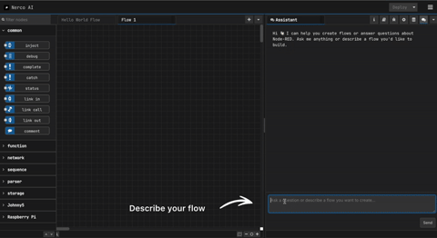

# Nerco AI 👋

https://nercoai.com

The AI Co-Pilot for Home, Building and Industrial Automation

## Demo 📹




## Quick Start 🚀

### Run With Docker
```
docker run -p 3000:3000 public.ecr.aws/x8e5h7k9/nerco-ai/ai-assistant:latest
```

### Get OpenAI API Key
1. Go to [OpenAI Platform](https://platform.openai.com/)
2. Sign up or log in to your account
3. Navigate to [API Keys](https://platform.openai.com/api-keys)
4. Click "Create new secret key"
5. Copy the API key and paste it into Nerco AI Assistant when prompted

> **Note:** You may need to add payment information to your OpenAI account to use the API.


### Run With NPM

If you want to run the latest code from git, here's how to get started:

1. Clone the code:

        git clone https://github.com/mohamedfawzy96/nerco-ai.git
        cd nerco-ai

2. Install the node-red dependencies

        npm install

3. Build the code

        npm run build

4. Run

        npm start
5. open localhost:3000

6. Get Anthropic API KEY
   - Go to https://console.anthropic.com/
   - Sign up for an account if you don't have one
   - Navigate to API Keys section
   - Create a new API key
   - Copy the API key and paste it into Nerco AI Assistant when prompted


## Discord Channel 💬


If you have any questions or want specific features, join our discord [channel](https://discord.gg/DYCBSUew)

## License Notice

This project contains source code derived from Node-RED, which is licensed under the Apache License 2.0. All such files retain their original license. Any original contributions in this repository are also licensed under the Apache License 2.0.

